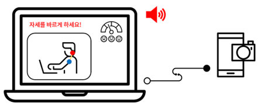

# 2023 1-2 오픈소스 기초설계 repo
## Members
- 권나현
- 문재민
- 류승희
---
## 컴쟁이들을 위한 자세 잔소리 프로그램

## About Project
이 프로그램은 사용자의 자세를 분석하여 잠수를 매기고 잘못된 자세가 일정 시간 이상 지속되면 경고를 하여 사용자가 스스로 자세를 고칠 수 있게 한다. 사용자는 현재 자신이 앉아 있는 자세를 직접 확인할 수 있고 잘못된 자세를 프로그램의 도움으로 인지할 있다. 

## Technology

 
    
    
    

